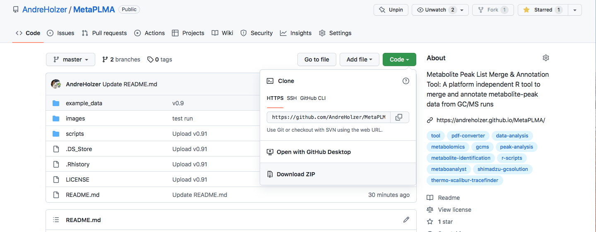

# Installing Metapolish package

[](GS.md) [](index.md) [](US.md)

----


## Clone/Download the repository from Github

### For Linux and Mac:

Get the latest version/release of the tool using the Pull or Git clone command

```
 git clone https://github.com/AndreHolzer/Metapolish --recursive
```


### Alternatively or for Windows: 

Go to the [Metapolish GitHub page](https://github.com/AndreHolzer/Metapolish) and download the latest release as .zip file or use this [quick download link](https://github.com/AndreHolzer/Metapolish/archive/master.zip) to get the latest version.



Unzip the folder using a common archive managing software such as [7zip](https://www.7-zip.org)


----
Now you are fully set up to start [using Metapolish](US.md)
