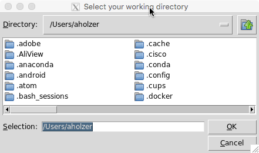
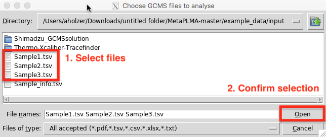
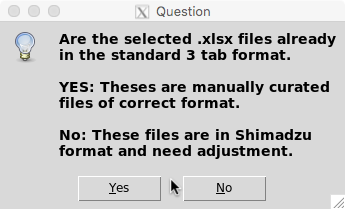
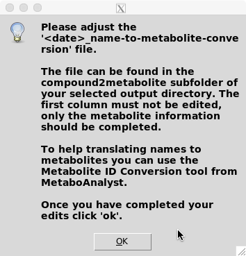
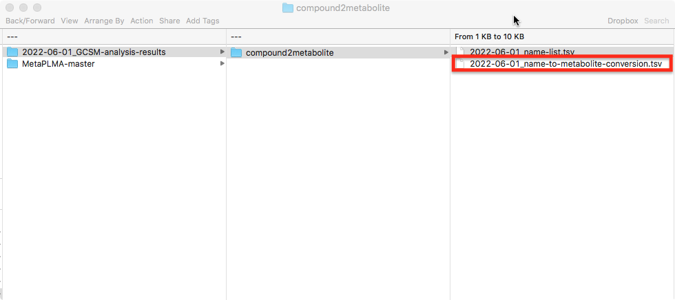
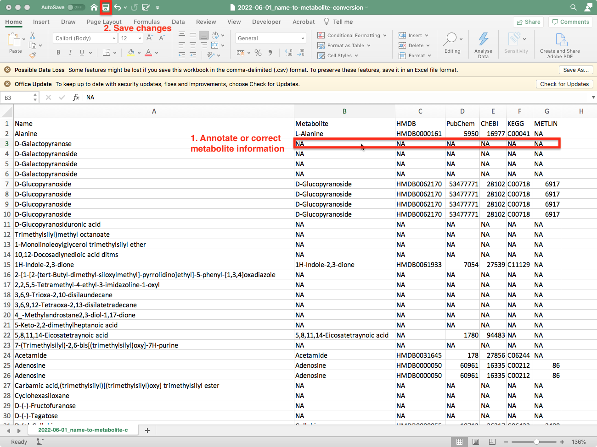
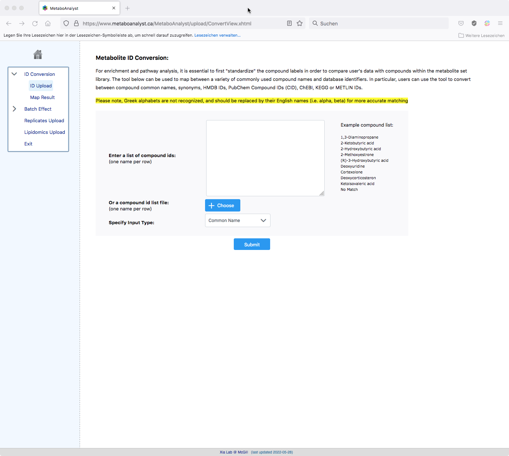
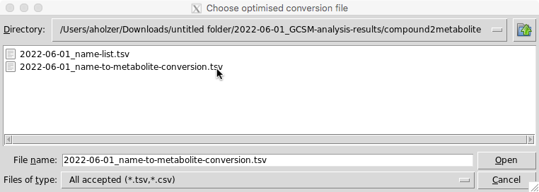

# Metapolish example run

[](US_E.md) [](index.md) [](US_O.md)

----


#### Example data

The tool comes with a set of GC-MS and LC-MS example data which is deposited in the [example_data](https://github.com/AndreHolzer/Metapolish/tree/master/example_data) folder. We recommend using this data for testing and training purposes. For a detailed usage example and tool guide, please have a look at the following steps.


> **IMPORTANT**: If you have several applications open at the same time as performing this analysis, the GUIs described in this section sometimes appear hidden behind other windows! Look out for them


#### Step 0: Initialisation

Once started the code by clicking '*Source*', the software will set up all the required packages for the analysis. This process might take several minutes especially during the first time executing the scripts. You can follow the progress in the *Console* window at the bottom of RStudio. This is in red but don’t worry, that’s ok.

Once the package installation is completed, the first GUI will pop up to let you define the working directory (location where the programme will store all outputs).



  Press okay to confirm your location of choice. 


#### Step 1: Read peak data input files
A second GUI will pop up allowing to select the GCMS files to be analyses. Note that a single as well as multiple files of the same file type can be analysed and combined at the same time.



Select all files to be analyse and press open.


##### Step 1.1: Convert files to interpretable table format (for .xlsx files only)

If files in .xlsx format were provided you will be asked whether these files are in Shimadzu format (.xlsx outputs from Shimadzu analysis) or manually curated .xlsx files (see allowed [input formats](US.md)). In the former case, the program will covert the Shimadzu files into an interpretable table format containing three columns (Compound, Retention time, Response).




#### Step 2: Load dry weight data (optional)  

You are then asked to select the file containg your sample dry weight information for normalisation. 


Click open once selected or cancel if you don't want to perform dry weight normalisation.


#### Step 3-5: Merge, normalise & convert names

Internally the script will now start merging sample peak data into a matrix which is then polished. If sample dry weights have been provided response data will be normalised. Afterwards, compound names are converted into metabolite names with the help of MetaboAnalysist's API.

The compound to metabolite name conversion table is then stored under: 

```
<working_dir>/<date>GCSM-analysis-results/compound2metabolite/<date>name-to-metabolite-conversion.tsv
```

and the results of this automated name conversion is provided in another pop up GUI:


You can either select to further manually curate the compound to metabolite conversion file now ("Yes") or proceed with the analysis ("No"). 

> **Note:** Although the algorithm is doing a great job with associating compounds to metabolites, only a subset of compound names can automatically be converted to metabolites with high confidence (In this example ~57%). If you are interested in getting the most out of your experiments, we recommend to check the conversion files and make manual adjustments to them. To do so select "Yes" and follow Step 5.1. Otherwise the software will continue with Steps 6-8. 


##### Step 5.1: Adjust compound to metabolite conversion file (optional)

To further improve the proportion of compound names that can be translated into metabolites the automatically generated conversion table can be corrected manually.

If you have selected this option, the following GUI will appear:




To do so please edit the /<date/>_name-to-metabolite-conversion.tsv file. The file which can be found in the compound2metabolite subfolder of your output directory can be opened and modified i.e via Excel. 




> **ATTENTION:** The first column contains the simplified compound name must not be changed.




To help translating names to metabolites you can use the Metabolite ID Conversion tool. If the website does not open automatically follow this link: https://www.metaboanalyst.ca/MetaboAnalyst/upload/ConvertView.xhtml. 




Once you have completed your edits save the modified excel file and select click 'ok' on the GUI. You will then be asked to re-upload your modified table:




#### Step 6-8: Final polishing and data export steps

Once proceeded with the analysis, the data frames will be sorted, condensed, used to plot retention time (RT) distributions and finally RT and Response time data is saved under: \<work_dir\>/\<date\>_GCSM-analysis-results/peak_data


  


> **IMPORTANT**: Once the analysis has finished check progress log and console to see whether there were any errors.


----
Now let's have a look at [the output](US_O.md)
