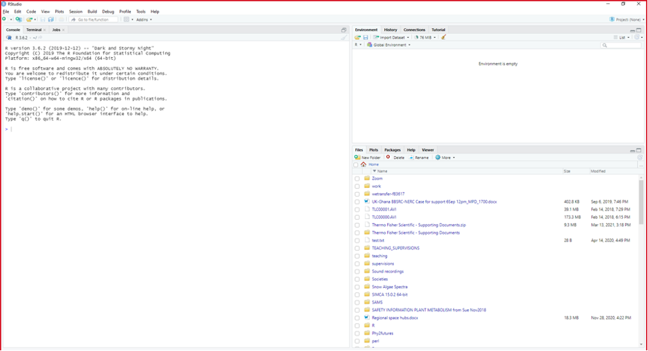
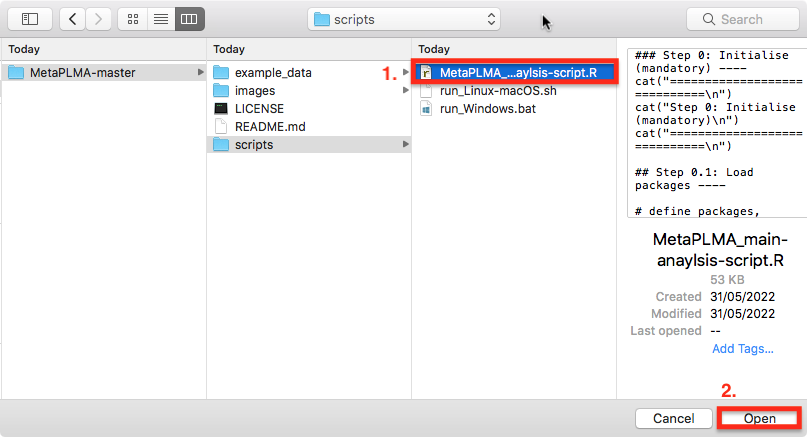
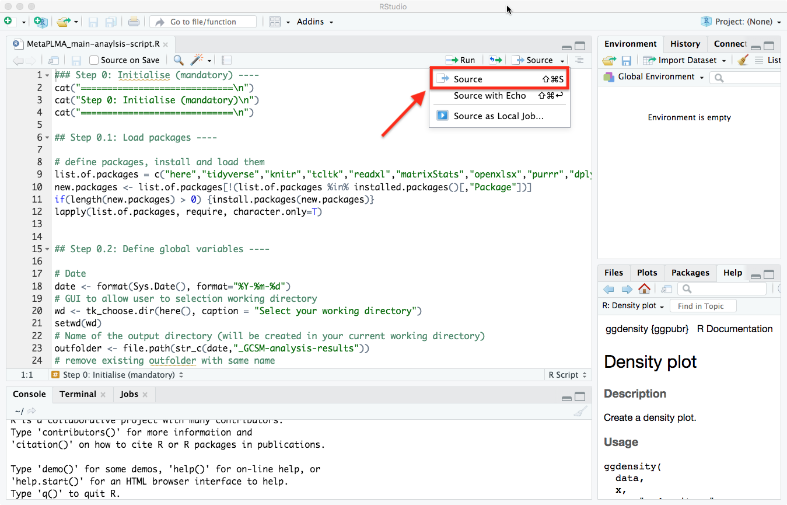

# Execute Metapolish 

[](US.md) [](index.md) [](US_A.md)

----

## Mode of execution

### Full interactive track 

***(GUI + progress log + full error reporting + code interaction possible)***

As of the current version the full interactive mode does not require any deeper knowledge of R coding nor requires computational skills but rather can be operated by anyone using Studio and the Graphical user interphases (GUIs) provided. 

#### **To start Metapolish simply follow the steps below:** 

##### 1. Start RStudio on your computer

##### 2. Load/open the main analysis script 

Open [Metapolish_main-anaylsis-script.R](scripts/Metapolish_main-anaylsis-script.R) from the Metapolish folder you have previously downloaded.

> File -> Open File -> Select Metapolish_main-anaylsis-script in ~/Downloads/Metapolish-master/scripts

  Click install if asked to install additional R packages

##### 3. Click *Source* to run the analysis

  

----

Next let's analyse some [example data](US_A.md)
