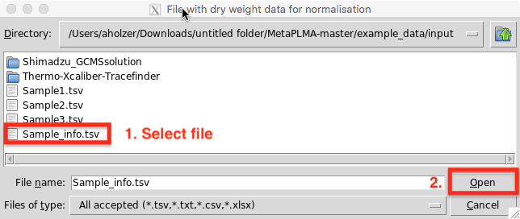
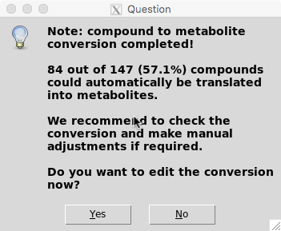
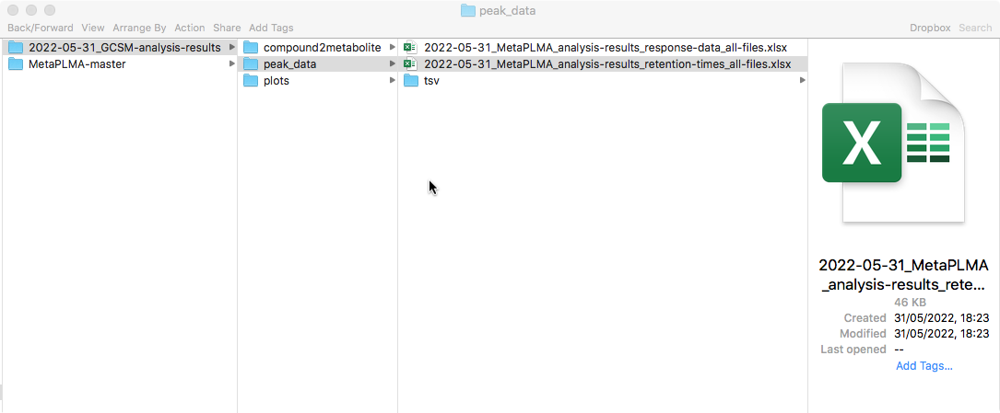

# Execute MetaPLMA 

[](US.md) [](index.md) [](US_E.md)

----
## Mode of execution

### Full interactive track (GUI + progress log + full error reporting + code interaction possible)
As of the current version the full interactive mode does not require any knowledge of R coding nor complex computational skills but rather can be operated by everyone using the Grphical user interphases (GUIs) provided. 
To excute MetaPLMA simply following the steps below: 

#### 1. Start RStudio on your computer
    
  
#### 2. Load/open the main analysis script ([MetaPLMA_main-anaylsis-script.R](scripts/MetaPLMA_main-anaylsis-script.R)) from the MetaPLMA folder you have previously downloaded.
  File -> Open File -> Select MetaPLMA_main-anaylsis-script in ~/Downloads/MetaPLMA-master/scripts
  Click install if asked to install additional R packages
    
  
#### 3. Klick *Source* to run the analysis
    
 
----
## Step by step explanation

### Step 0: Initialisation
Now the software will start setting up all the required packages for the analysis. This process might take several minutes espcially the first time you are excuting this script. You can follow the progress in the *Console* window at the bottom of RStudio. This is in red but don’t worry, that’s ok.

Once the package installation is completed, the first GUI will pop up to let you define your working directory (Location where the programme will store the output folder and files).

    
  Press okay to confirm your location of choise. 

### Step 1: Read peak data input files
Another GUI will pop up allowing you to select your GCMS files to be analyses. Note that a single as well as multiple files of the same file type can be analysed and combined at the same time.

    
    
Select all files to be analyse and press open.

If you have provided files in .xlxs format you will be asked whether the files are direct Shimadzu output files or manually curated .xlxs. In the former case, the program will covert the Shimadzu files into the standrad table format.

    
  
### Step 2: Load dry weight data (optional)  
You are then asked to select the file containg your sample dry weight information for normalisation. 

    
Click open once selected or cancel if you don't want to perform dry weight normalisation.

### Step 3-5: Merge sample information into a matrix, normalise response data & convert compound names into metabolite names
Internally the script will now start merging sample peak data into a matrix and then polish that dataframe. If sample dry weights were provided response data will be normalsied too. Convert compound names will be converted into metabolites using using MetaboAnalysist API.

Resulst of this conversion are then stored under: \<working_dir\>/\<date\>_GCSM-analysis-results/compound2metabolite/\<date\>_name-to-metabolite-conversion.tsv with results summarised in another GUI which pops up.

   
You can either select to further manually cureate the compound to metabolite conversion file now ("Yes") or proceed with the analysis ("No").

### Step 6-8: Sort and condense dataframes, plot retention time distributions and export/wave RT and Response matrix/dataframes 
Once proceeded with the analysis the datfarmes wil be sorted, condensed, used to plot retention time distributions and finally saved under: \<work_dir\>/\<date\>_GCSM-analysis-results/peak_data

   

> **IMPORTANT**: Once the analysis has finished check progress log and console to see whether there were any errors.
  
----
Now let's have a look at [the output](US_O.md)
